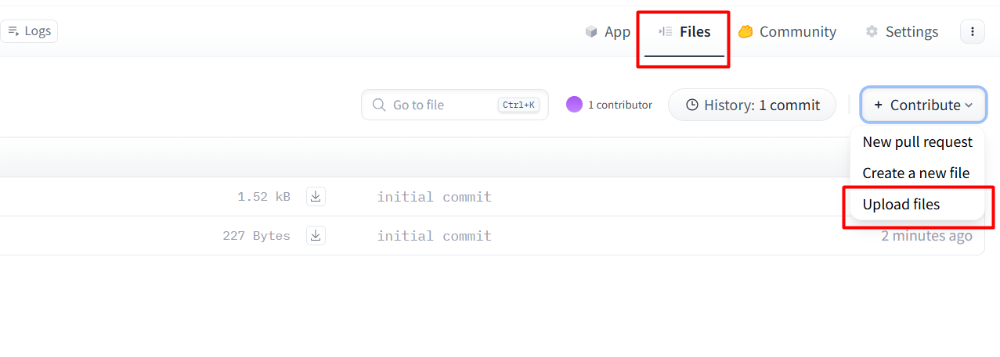

# Hướng dẫn deploy source code python lên Hugging Face

Một số lưu ý:

- Không upload/commit file `.env` của dự án
- Xóa các file `.bin` của ChomaDB, thư mục `.egg-info`, thư mục `__pycache__` trước khi upload để cho gọn source code

## Các bước deploy

1. Đăng ký tài khoản [Hugging Face](https://huggingface.co/) nếu chưa có

2. Truy cập vào Space -> New Space để tạo mới 1 repo (hoặc truy cập trực tiếp link này https://huggingface.co/new-space)

3. Điền thông tin repo cần tạo, ở bước **Select the Space SDK** chọn **Gradio**, template là **Blank**, loại repo là **public**

4. Có thế dùng git để clone và push code như hướng dẫn sau khi tạo, hoặc dùng chức năng upload có sẵn. Hướng dẫn này dùng chức năng upload.



5. Tiến hành thiết lập môi trường

- Nếu dự án sử dụng file `pyproject.toml` thì cần tạo thêm file `requirements.txt` tương ứng vì Hugging Face chưa hỗ trợ, `requirements.txt` là bắt buộc (nhờ AI chuyển đổi)

- Thêm các dòng sau đây vào **đầu** file `README.md`:

    ```Markdown
    ---
    title: IT Helpdesk Bot
    emoji: 💬
    colorFrom: indigo
    colorTo: blue
    sdk: gradio
    sdk_version: "5.49.1"
    app_file: main.py
    pinned: false
    ---
    ```

    Trong đó `app_file` chỉ ra file bắt đầu chạy dự án

- **Bắt buộc**: Chỉnh sửa source code cho gradio chạy ở port `7860`

6. Tiến hành upload source code, có thể chọn nhiều file/thư mục cùng lúc.

    > ⚠ Lưu ý quan trọng: không upload/commit file `.env`

7. Thêm biến môi trường (các biến từ `.env`)

    - Truy cập phần **Setting** của repo, tìm đến **Variables and secrets**
    - Nhập các giá trị API key từ `.env` vào **Secret** (nhấn vào `New secret`)
    - Các giá trị khác như URL, tên model, PYTHONPATH có thể đặt ở **Variables**
    - Đặt biệt với `PYTHONPATH`, cần thêm tiền tố /app trước giá trị ban đầu. Ví dụ giá trị ở `.env` là
        ```
        PYTHONPATH=./src
        ```
        Thì khi tạo variable sẽ là
        ```
        PYTHONPATH=/app/src
        ```
    
8. Chờ quá trình build hoàn tất và tận hưởng thành quả